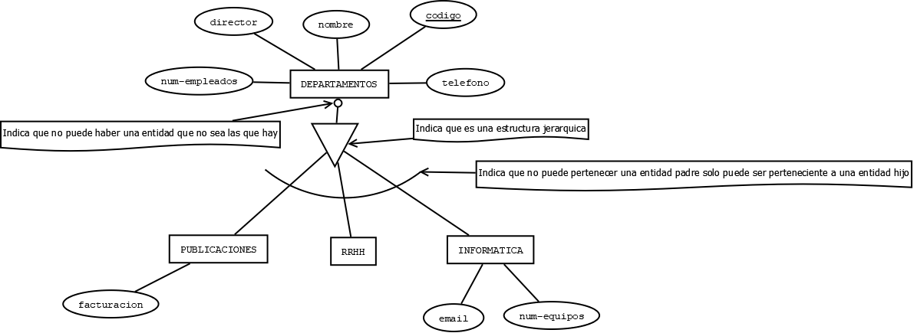
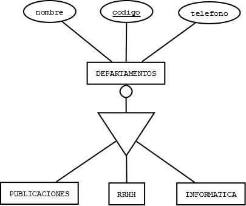
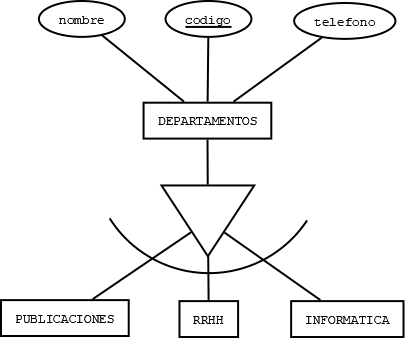

# Modelo Entidad-Relación

Consiste en un conjunto de conceptos, reglas y notaciones que permiten formalizar la semántica del mundo real que se pretende modelar en una representación gráfica o diagrama que denominamos esquema de la base de datos.

## Elementos

### Entidades

Representan conjuntos de elementos con existencia propia, que se caracterizan, por las mismas propiedades. Conceptos sobre los que necesitamos guardar información.

- Representación → Rectángulo, sustantivo en mayusculas
- Ejemplo: personas, cosas, lugares.

### Interrelaciones

Son asociaciones entre una o más entidades.

- Representación → Rombo unido a las entidades mediante líneas, verbo representativo con la inicial en mayúscula

- Ejemplos: los clientes compran un libro, alumnos estudiar cursos.
- Elementos
    - **Cardinalidad:** número mínimo y máximo de ejemplares de un tipo, que pueden relacionarse con un elemento de la otra entidad.
        
        
        - Representación → Número min y max entre paréntesis separados por una coma
            - Se pone n sustituyendo al número min o max si no se sabe su valor.
            - La entidad con cardinalidad max n tendrá como conexión una flecha saliente de la interrelación con dirección hacia la entidad.
        
        
        
    - **Grado:** número de entidades que intervienen en la interrelación. Normalmente 2.
    - **Tipo de correspondencia:** número máximo de ejemplares de una entidad que puede estar asociados con un ejemplar de la otra entidad
        - Representación → Número máximo de la cardinalidad de cada entidad
            - (1,1) y (1,1) → 1:1
            - (1,1) y (1,n) → 1:N
            - (1,n) y (1,n) → N:M
        
        
        
        
        

### Atributos

Son características de las entidades que queremos recoger dentro de nuestro diseño.

- Representación → Elipse, nombre en minúscula
- Ejemplo: nombre de un cliente, dirección, teléfono. Describen las propiedades de cada miembro de la entidad cliente.

- Tipos
    - **Clave:** aquel atributo que es único para la entidad → Subrayado
    - **Atributos obligatorios:** aquel atributo que es obligatorio tenerlo
    - **Atributos opcionales:** aquellos de los cuales no tenemos por qué tener información. → Línea de unión con la entidad discontinua
    - **Clave debil:** otro identificador que permite referirse a un elemento de la entidad → Subrayado discontinuo
    - **Multivaluados:** son atributos que pueden tener varios valores → Doble elipse
    - **Derivados:** es una característica que se puede extraer de otras que ya existen → Elipse discontinua
    - **Atributos de la interrelación:** atributos que no pertenecen a las entidades, solo tienen sentido, cuando hay una interrelación que los une. → Se une el atributo a la interrelación.
    
    
    

### Dominios

Nota que define los valores únicos posibles para un atributo.

- Representación → Escribíendose debajo del diagrama
- Ejemplo: Nacionalidad

## Jerarquías

Representación del modelo entidad-relación en el que una entidad actúa como superentidad (entidad de nivel superior) de otras subentidad (entidades de nivel inferior). Las subentidades heredan atributos de la superentidad.

- Representación → Triángulo invertido que hace de relación entre la superentidad y las subentidades, las entidades se unen al él mediante líneas
- Ejemplo: superentidad (departamentos) subentidades (publicaciones, recursos humanos e informática)

### Tipos de relaciones

**Relación total:** jerarquía en la cual un registro de la superentidad está obligatoriamente relacionada con las subentidades.

- Representación → Círculo en la línea de unión entre la superentidad y el triángulo
- Cardinalidad mínima de la superentidad → (1,x)

**Relación exclusiva:** jerarquía en la cual un registro de la superentidad, solo puede estar relacionado con una subentidad.

- Representación → Arco por debajo del triángulo invertido

